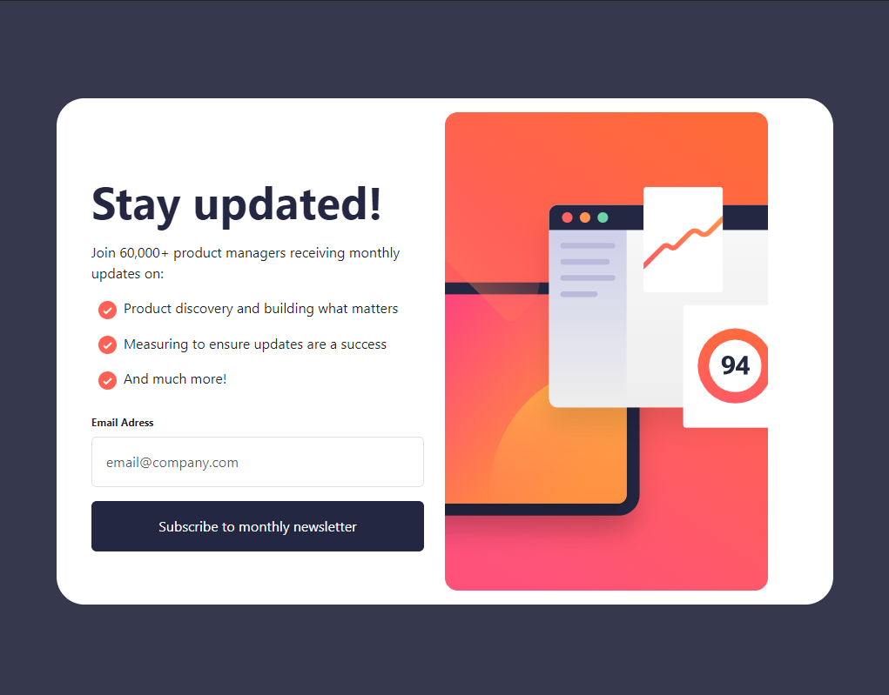
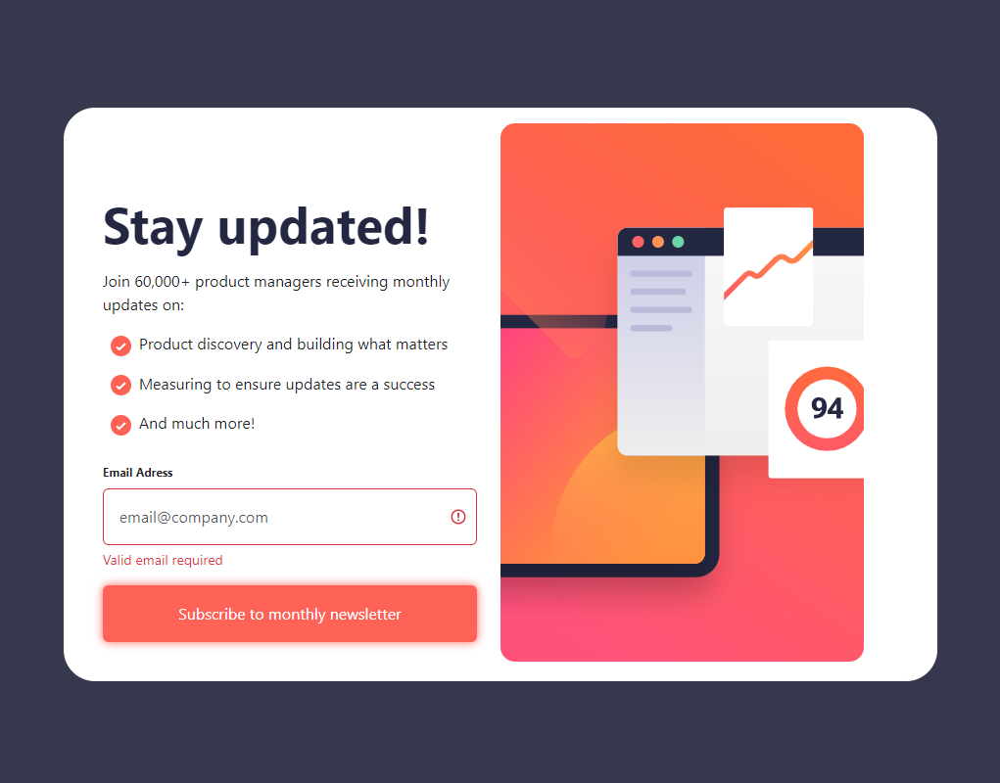
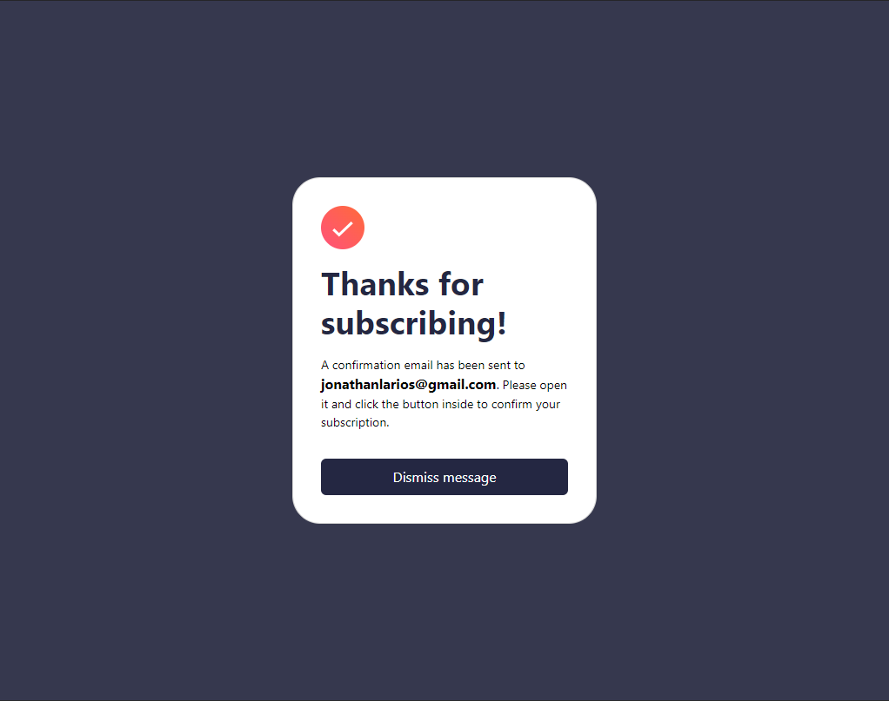

# Frontend Mentor - Newsletter sign-up form with success message solution

  

This is a solution to the [Newsletter sign-up form with success message challenge on Frontend Mentor](https://www.frontendmentor.io/challenges/newsletter-signup-form-with-success-message-3FC1AZbNrv). Frontend Mentor challenges help you improve your coding skills by building realistic projects. 

### Links

- 📤 Solution URL: [Add solution URL here](https://github.com/JonathanEKP/newsletter/tree/main)
- 📍 Live Site URL: [Add live site URL here](https://jonathanekp.github.io/newsletter/)

## Table of contents

- [Overview](#overview)
  - [The challenge](#the-challenge)
  - [Screenshot](#screenshot)
- [My process](#my-process)
  - [Built with](#built-with)
- [Author](#author)

## Overview

### The challenge

Users should be able to:

- Add their email and submit the form
- See a success message with their email after successfully submitting the form
- See form validation messages if:
  - The field is left empty
  - The email address is not formatted correctly
- View the optimal layout for the interface depending on their device's screen size
- See hover and focus states for all interactive elements on the page

### Screenshot

##### Home Page Desktop

#### Thanks Desktop

#### Home Page Mobile

#### Thanks Mobile

## My process

### Built with

- Semantic HTML5 markup
- CSS custom properties
- [React](https://reactjs.org/) - JS library
- [Bootstrap](https://getbootstrap.com/) - For styles
- [React-Router-Dom](https://reactrouter.com/en/main) -Routes

## Author

- Website - [Jonathan Larios](https://jonathanekp.github.io/Portafolio/)
- Frontend Mentor - [@JonathanEKP](https://www.frontendmentor.io/profile/JonathanEKP)
- GitHub - [JonathanEKP](https://github.com/JonathanEKP)
